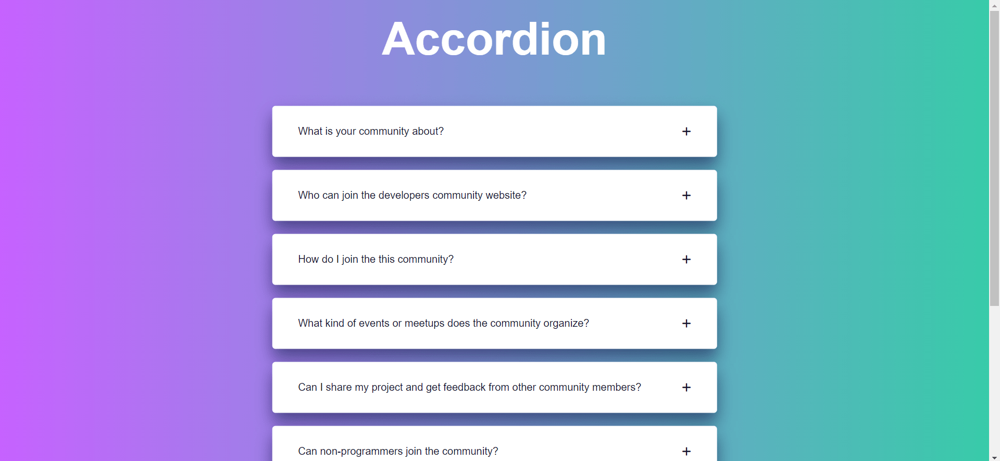

# Accordion

An Accordion is a graphical user interface (GUI) widget that allows users to expand and collapse embedded content. This project is a simple implementation of an accordion using HTML, CSS, and JavaScript, where users can click on a question to reveal its answer.

## Getting Started

To view the project, download the ZIP file or clone the repository on your local machine. Open the index.html file in your browser.

## Prerequisites

To run this project, you need a web browser installed on your machine. It has been tested on Google Chrome, Mozilla Firefox, and Microsoft Edge.

## Built With
<ul>
  <li>HTML</li>
  <li>CSS</li>
  <li>JavaScript</li>
</ul>

### Contributors
  Neha Nupur
  
 ## Acknowledgments
  <ul>
    <li><strong>Font Awesome - </strong>Free icons used in the project</li>
  <li><strong>Inspiration - </strong>W3Schools - How To Create An Accordion</li>
</ul>

## Screenshots
   
 
## How to use
  Click on any question to reveal its answer. You can only have one answer open at a time - when you click on another question, the currently open answer will be closed.
   
